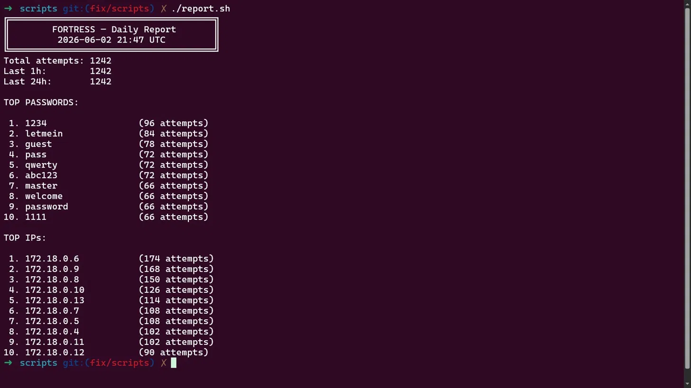
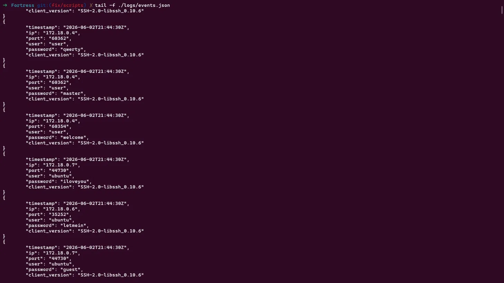

# Fortress

A containerized SSH honeypot written in C that captures attacker credentials in real time, aggregates brute-force patterns, and generates threat reports.

Built as a portfolio project to explore systems programming, network security, and container hardening.

---

## Architecture

```
┌──────────────────────────────────────────────────────────┐
│  Docker network: fortress (bridge)                       │
│                                                          │
│  ┌─────────────────────┐        ┌──────────────────────┐ │
│  │   honeypot (C)      │        │    logger (C)        │ │
│  │                     │        │                      │ │
│  │  epoll loop         │        │  parse events.json   │ │
│  │  fork() per conn    │─logs──▶│  hashmap aggregation │ │
│  │  libssh trap        │        │  min-heap top 10     │ │
│  │  JSON logger        │        │  write stats.json    │ │
│  └─────────────────────┘        └──────────────────────┘ │
│           │                               │               │
│     port 2222                     ./logs/stats.json       │
│                                           │               │
│                                           ▼               │
│                                  ./scripts/report.sh      │
└──────────────────────────────────────────────────────────┘
```

Two containers share a single volume. The honeypot only captures. The logger only analyses. If the honeypot is ever compromised, the logger is unaffected.

---

## How It Works

**1. Connection accepted**
The honeypot opens a TCP socket on port 2222 and uses `epoll` to monitor it for incoming connections. When a connection arrives, it calls `fork()` — the child handles the SSH session, the parent goes back to waiting.

**2. SSH handshake**
The child process uses `libssh` (`ssh_bind`, `ssh_bind_accept_fd`) to perform a real SSH key exchange. The server presents an RSA host key generated fresh at image build time. This is enough to fool automated tools like Hydra and Metasploit into thinking they're talking to a real SSH server.

**3. Credential capture**
After the key exchange, the honeypot waits for `SSH_REQUEST_AUTH` messages with subtype `SSH_AUTH_METHOD_PASSWORD`. Every username and password is extracted via `ssh_message_auth_user()` and `ssh_message_auth_password()`, then rejected with `ssh_message_reply_default()` to keep the attacker trying.

**4. JSON logging**
Each authentication attempt is written as a JSON event to `/var/log/fortress/events/events.json`:

```json
{
  "timestamp": "2025-04-01T14:32:11Z",
  "ip": "45.33.32.156",
  "port": "54321",
  "user": "root",
  "password": "123456",
  "client_version": "SSH-2.0-libssh-0.9.3"
}
```

**5. Aggregation**
The logger container reads the events file every 60 seconds. It parses each JSON object line by line using `get_next_line`, inserting passwords and IPs into two separate hashmaps. Each hashmap uses a djb2-style hash function with 256 buckets and chaining for collision resolution. To find the top 10 entries, a min-heap of size 10 is built over the hashmap — O(n log 10) — and then sorted with insertion sort. The result is written to `stats.json`.

**6. Report**
`./scripts/report.sh` reads `stats.json` and prints a formatted report to the terminal.

---

## Security Decisions

**`cap_drop: ALL` + `cap_add: NET_BIND_SERVICE`**
By default Docker containers inherit a broad set of Linux capabilities. Dropping all of them and adding back only `NET_BIND_SERVICE` means the honeypot process can bind to port 2222 and nothing else. It cannot modify network interfaces, write to arbitrary files, or escalate privileges — even if an attacker somehow breaks out of the SSH trap.

**`read_only: true`**
The container filesystem is mounted read-only. The only writable paths are the shared log volume and `/tmp` and `/run` via `tmpfs`. This means any attempt to write to the container filesystem — drop a file, modify a binary — fails immediately.

**`tmpfs: [/tmp, /run]`**
Some processes need to write temporary files. Rather than making the whole filesystem writable, only `/tmp` and `/run` are mounted as in-memory tmpfs. Data written there never touches disk and disappears when the container stops.

**`mem_limit` and `cpus`**
Resource limits prevent a single container from consuming the host if it receives a flood of connections. The honeypot is capped at 256MB RAM and 0.5 CPU cores.

**SSH host key generated at build time**
The RSA host key is generated inside the Dockerfile with `ssh-keygen`. It never exists outside the container and is never committed to the repository. Every `docker build` produces a fresh key. For a honeypot this is the correct behaviour — there are no legitimate users whose `known_hosts` would be affected, and it avoids the risk of a static key leaking through version control.

**Separate logger container**
The logger has no network exposure and no capability to accept connections. Its only job is to read a file and write a file. This is the principle of least privilege applied at the container level.

---

## What I Built

| Component | Language | Key concepts |
|---|---|---|
| Honeypot | C | `epoll`, `fork`, `libssh`, JSON serialisation |
| Logger | C | Hashmap, min-heap, `get_next_line`, file I/O |
| Report | Bash | `sed`, `grep`, formatted terminal output |
| Infrastructure | Docker | Multi-container compose, volume sharing, hardening |

---

## Running

```bash
git clone https://github.com/youruser/fortress
cd fortress
make
```

`make` builds both images, cleans the host key from `known_hosts` to avoid false warnings, and starts both containers in the background.

```bash
# View live events
tail -f ./logs/events.json

# Generate a report
./scripts/report.sh

# Test with Hydra
hydra -l root -P wordlist.txt ssh://localhost:2222

# Stop everything
make down
```

---

## Example Output

Live capture during a simulated brute-force attack:



Report generated after aggregation:



---

## What I Learned

C is my primary language, but this project pushed it into territory I hadn't touched before. The hardest part was working with `libssh` — the documentation is sparse and understanding the flow of `ssh_bind_accept_fd` → `ssh_handle_key_exchange` → `ssh_message_get` took real trial and error. Getting `epoll` right alongside `fork()` also required careful thought: the child process needs to close the epoll fd and the listening socket before doing anything else, otherwise file descriptor leaks cause subtle bugs that only appear under load.

Building the hashmap and min-heap from scratch in C for the logger was a deliberate choice. I wanted to understand the data structures rather than reach for a library. The heap gives O(n log 10) to find the top 10 entries over an arbitrarily large dataset — constant space regardless of how many events accumulate.

Docker hardening was new to me. I knew `cap_drop` existed but understanding *which* capabilities to drop and *why* — and then adding `tmpfs` to handle the edge cases that `read_only` introduces — made the security model concrete rather than theoretical.

---

## Project Structure

```
fortress/
├── docker-compose.yml
├── Makefile
├── scripts/
│   └── report.sh
├── honeypot/
│   ├── Dockerfile
│   ├── Makefile
│   └── src/
│       ├── main.c          ← epoll loop, signal handling
│       ├── ssh_trap.c      ← libssh bind, key exchange, credential capture
│       ├── logger.c        ← JSON event writer
│       └── utils.c         ← SIGINT / SIGCHLD handlers
└── logger/
    ├── Dockerfile
    ├── Makefile
    └── src/
        ├── main.c              ← 60s poll loop
        ├── stats_writer.c      ← JSON parser, stats aggregation
        ├── hash_map.c          ← hashmap with chaining
        └── algorithm/
            └── heap_sort.c     ← min-heap + insertion sort for top 10
```